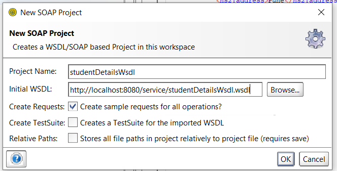
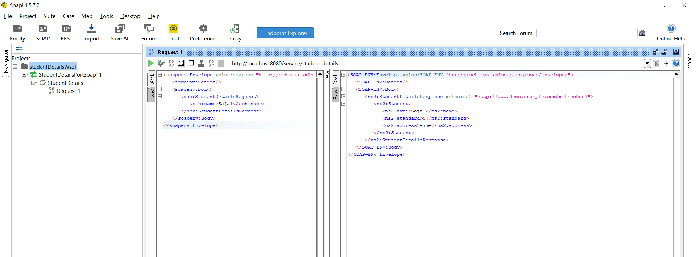

https://howtodoinjava.com/spring-boot/spring-boot-soap-webservice-example/

Stack: jdk 17, SOAP

I. Access to root PRJ folder and run
1. mvn clean install
2. java -jar target\<file .jar after build>
3. go to http://localhost:8080/service/studentDetailsWsdl.wsdl to check
4. open SoapUI and create new SOAP with this url, the app will auto-detect others

5. access to request1 and test


II. Step to create this project: 
1. go to spring initialize to create springboot java 17 maven 
2. add dependency follow POM.xml
```
<dependency>
   <groupId>org.springframework.boot</groupId>
   <artifactId>spring-boot-starter-web-services</artifactId>
   </dependency>

<dependency>
  <groupId>wsdl4j</groupId>
  <artifactId>wsdl4j</artifactId>
</dependency>
```


and plugin below <build> <plugins></plugins> </build> to approach the contract-first ( create model Xsd and run cmd to generate java class )


```
    <plugin>
      <groupId>org.codehaus.mojo</groupId>
      <artifactId>jaxb2-maven-plugin</artifactId>
      <version>3.1.0</version>
      <executions>
        <execution>
          <id>xjc</id>
          <goals>
            <goal>xjc</goal>
          </goals>
        </execution>
      </executions>
      <configuration>
        <sources>
          <source>src/main/resources/student.xsd</source>
        </sources>
        <outputDirectory>src/main/java</outputDirectory>
        <clearOutputDir>false</clearOutputDir>
      </configuration>
    </plugin>
```
Note: the <source>src/main/resources/student.xsd</source> is declared the model file, if you add new model. you should update this in plugin tag

3. after create Xsd model file, run mvn compile to generate java class
note that: the "xmlns:tns" and "targetNamespace" has same url, and same with prj structure: 
ex: http://www.demo.example.com/xml/school with path: src/main/java/com/example/demo/
4. create endpoint for model with @Endpoint: this is place like service: call repository to interact with data
5. create configuration with @EnableWs & @Configuration: config soap, url to access, namespace,...
6. run like (I) above
7. url is base on soapConfig.java.
ex: http://localhost:8080/service/carWsdl.wsdl